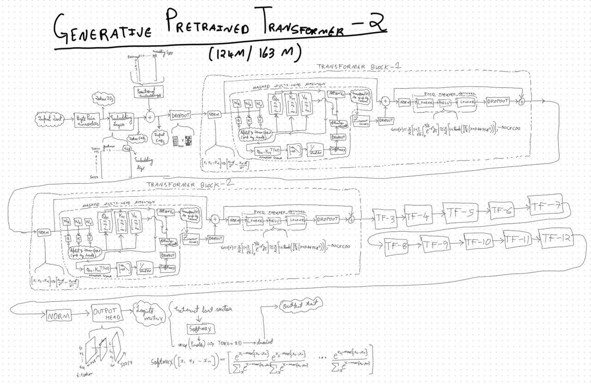

# GPT-2 From Scratch
This repo contains the custom implementation of [GPT-2](https://openai.com/index/gpt-2-1-5b-release/). This implementation was created following the playlist ["LLMs from Scratch" by Vizuara](https://youtube.com/playlist?list=PLPTV0NXA_ZSgsLAr8YCgCwhPIJNNtexWu&si=eksVKcxWNTVzJRUa). The original course has all the code in an ```ipynb``` notebook.

As I was following along the course, I have modularized the said implemenation and have also created an OpenAI weights compatible implementation (not covered in the course). In the course, the OpenAI's tensorflow weights were preprocessed and then injected into the custom implementation, whereas in my OpenAI compatible implementation (located in [compat folder](compat/)), I have used a larger (combined) K,Q,V matrix that aligns with the OpenAI weights, whereas the custom implementation (in the course) deals with this separately.

The scripts used to map the OpenAI weights (PyTorch weights downloaded from hugging face) to my OpenAI compatible implementation is [mapper_v3.py](./mapper_v3.py).



## Example Usage
Example usage of my OpenAI compatible implementation (alongwith various utilities I have created):
```python
from impl.utils import (
    perform_non_cpu_backend_check,
    generate,
    text_to_token_ids,
    token_ids_to_text,
    get_gpt2_tokenizer,
    load_openai_355m_gpt2
)

device = perform_non_cpu_backend_check()

def main():
    tokenizer = get_gpt2_tokenizer()
    model = load_openai_355m_gpt2(device=device, eval_mode=True)

    prompt = (
        "Is the following text 'spam'? Answer with 'yes' or 'no':"
        "'You are a winner you have been specially selected"
        " to receive $1000 cash or a $2000 award.'"
    )

    token_ids = generate(
        model=model,
        idx=text_to_token_ids(prompt, tokenizer),
        max_new_tokens=35,
        context_size=1024,
        top_k=25,
        temperature=1.4
    )

    print("Output text:\n", token_ids_to_text(token_ids, tokenizer))

if __name__ == "__main__":
    main()
```

Please note that the model is loaded as:
```python
def load_openai_355m_gpt2(device: str, eval_mode: bool = False) -> OpenAICompatibleGPTModel:
    model = OpenAICompatibleGPTModel(OPENAI_GPT_2_CFG_355M).to(device)
    model.load_state_dict(torch.load("bin/gpt2_355m_compat_openai.pth", map_location=device))

    if eval_mode:
        model.eval()

    return model
```

Do ensure that the relevant files exist in the directory.

## Regarding the weights
When I figure out how to use ```git lfs``` then, they should be available.